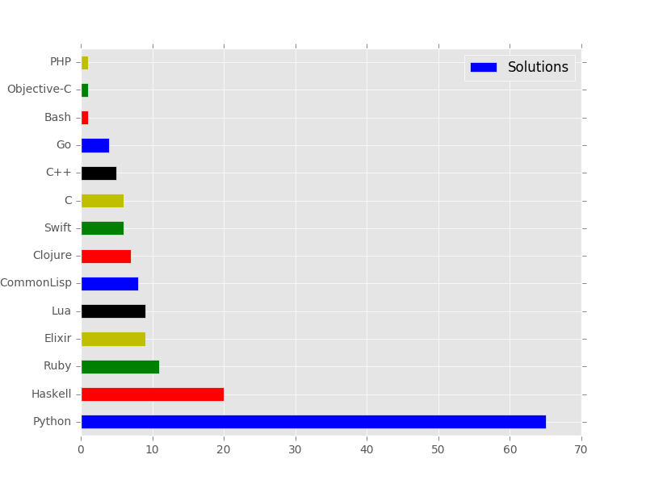
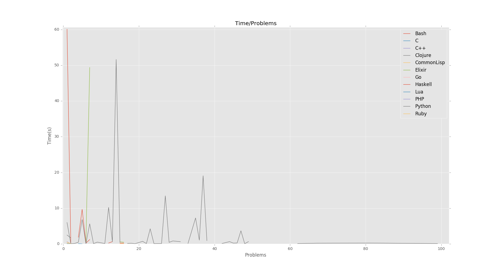

# ProjectEuler
Compilation of some solutions of the challenges existent in the website www.projecteuler.net

## Graphs

## Test

You can now test the algoritms just using on our Docker image hosted on
`destructhub/project_euler` just calling: `docker-compose run async`
or `docker-compose run sync`.  Assuming of course that you have a
`docker` installation with `docker-compose`.  On the end of execution,
will be print a tabular-like structure with information about problem,
language, time execution and if the answer is correct.

The asynchronous build is written in Elixir, the synchronous version
is written in Python. You can look on both systems at `stats.exs` and `stats.py`.

## Status

Check the status of our roadmap here: [STATUS.md](STATUS.md)

## Rules

Check the rules of the repository here:  [RULES.md](RULES.md)

### Authors and Contributors

Check the ProjectEuler badges and tables by nickname: [SOLVERS.md](SOLVERS.md)
